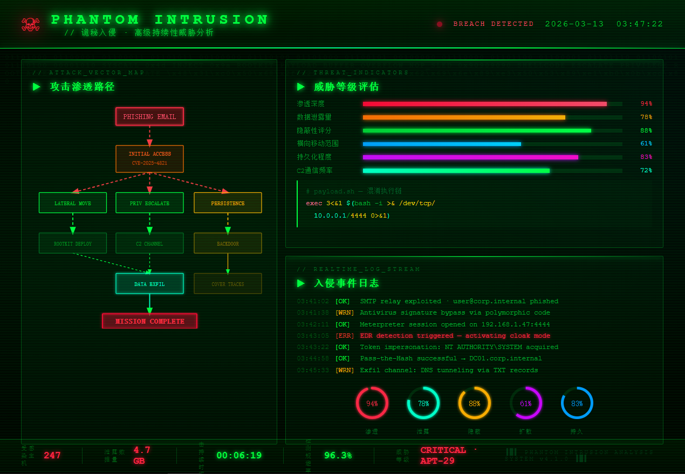
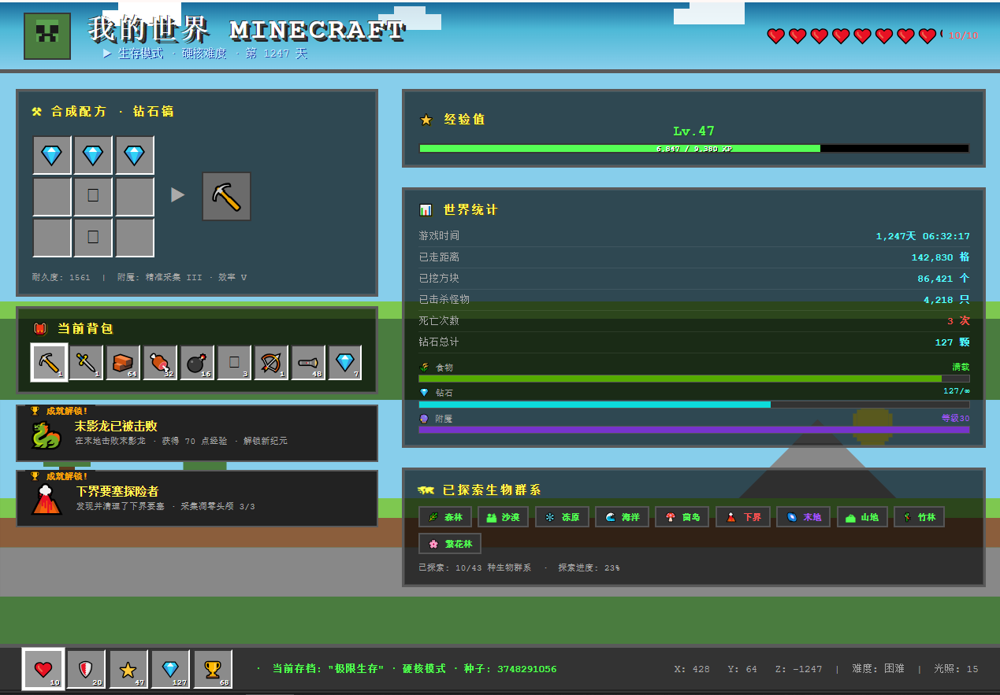
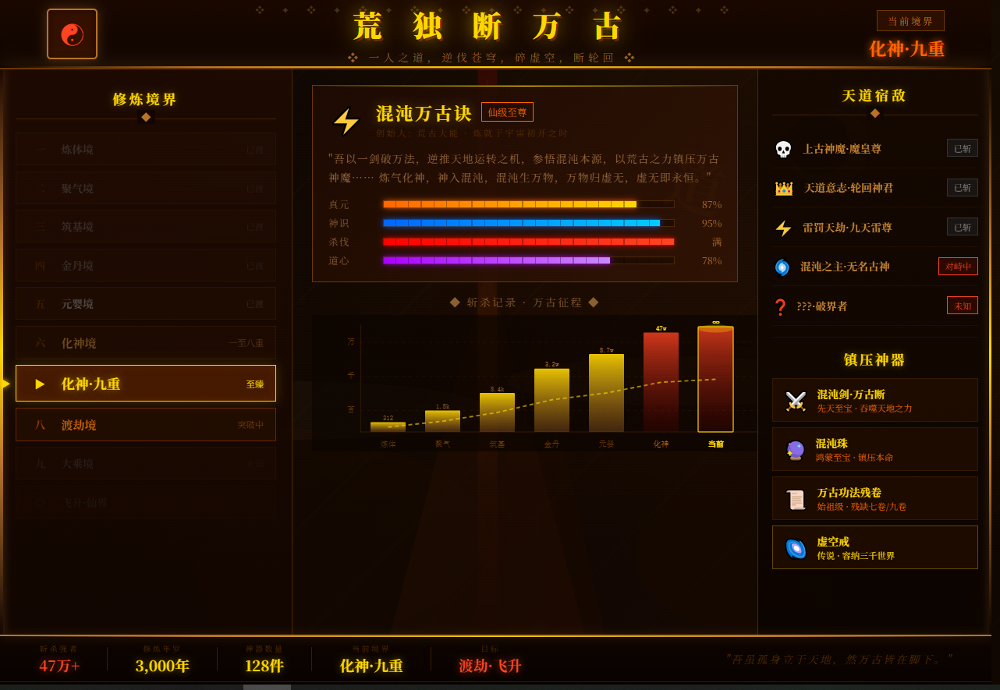
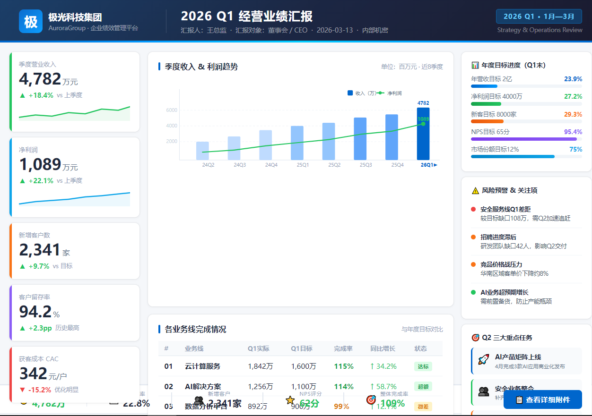
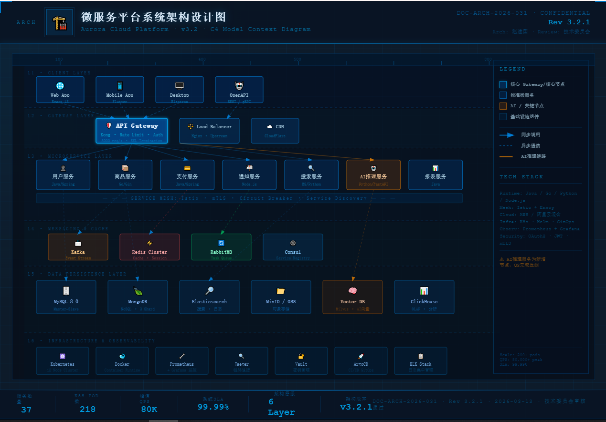
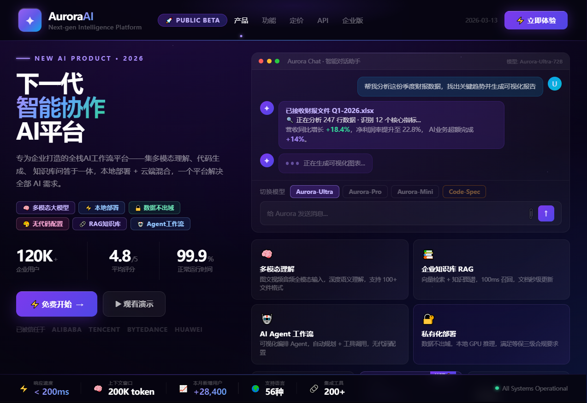

[](README.md) [](README_EN.md)

# 🎨 html-report Skill · PPT 视觉报告生成器

> **不知道怎么设计 PPT？一句话触发，自动生成精美的 PPT 风格 HTML 页面。**
> 截图即可粘贴为幻灯片，零手动排版，零设计经验要求。

---

## ✨ 是什么

`html-report` 是一个 AI 智能体 Skill，将任意文字内容自动转化为**可截图的 PPT 风格 HTML 页面**。

支持 Claude Code、豆包、Cursor、Windsurf 等主流 AI 编程助手。每页严格锁定 **1017×720px**（对齐 PPT 画布 10.59"×7.499" @96dpi），截图后可直接粘贴为幻灯片，无需任何 PPT 软件操作。

当你：
- 🤔 **不知道 PPT 该怎么排版** → 说出主题，自动生成
- 📊 **需要图表可视化** → 12+ 种纯 SVG 图表，零依赖
- 🎨 **想要精美设计感** → 6 种视觉模板 × 7 套配色 = 168 种组合
- ⚡ **赶时间** → 4 秒生成一页，10 页报告约 1 分钟完成

---

## 🚀 快速使用

在任意 AI 智能体（Claude Code / 豆包 / Cursor 等）中，直接说：

```
生成报告：分析我们公司 2025 年的 AI 战略
```

```
把这份竞争分析做成 HTML 报告页面
```

```
内容可视化：量子计算技术趋势
```

AI 会自动完成：主题拆解 → 选模板 → 选配色 → 选布局 → 填内容 → 输出 HTML

---

## 🐟 HTML → PPT 一比一转换

> **生成 HTML 后，可直接发给豆包、Claude 等 AI，提示一句话即可转成 PPT！**

将生成的 HTML 文件内容复制，发给任意支持文件或长文本的 AI 智能体，附上以下提示词：

```
请按照这个 HTML 页面的布局、配色、图表和内容，一比一还原为 PPT 幻灯片（PPTX 格式）。
画布尺寸为 1017×720px，严格保持所有视觉元素的位置、大小、颜色不变。
```

**操作流程：**

```
① AI 智能体生成 HTML 文件
        ↓
② 将 HTML 内容/文件发给豆包或 Claude
        ↓
③ 粘贴提示词："按页面布局一比一转化为 PPT"
        ↓
④ 下载 PPTX，直接用于演示 ✓
```

---

## 🖼️ 样式展示

以下是本 Skill 能生成的各种风格示例，展示 AI 能根据主题自由创造的视觉语言：

---

### Theme 1 · 诡秘入侵 · 黑客终端风

> 适用：网络安全报告、威胁情报、CTF 展示、渗透测试分析



**特征：** 纯黑背景 + 矩阵绿 `#00ff41` · Share Tech Mono 等宽字体 · 扫描线动画纹理 · 终端命令行风格 · 氛围辉光叠层

---

### Theme 2 · 我的世界 · 像素方块风

> 适用：游戏报告、创意展示、青少年教育、极客趣味演示



**特征：** 像素化渲染风格 · Minecraft 色调（泥土/草地/天空） · 方块边框 · 像素字体模拟 · 游戏 UI 元素

---

### Theme 3 · 荒独断万古 · 中式古典史诗风

> 适用：国学报告、历史分析、文化传承、古典文学主题



**特征：** 极深褐黑背景 `#0a0502` · 金色主色调 `#d4a853` · Noto Serif SC 宋体 · 古卷纸纹理 · 水墨流光效果

---

### Theme 4 · 向老板汇报 · 商务专业风

> 适用：工作汇报、季度总结、业务分析、管理层演示



**特征：** 亮色高可读背景 `#f5f7fa` · 深蓝专业配色 `#0f3460` · 系统默认字体栈 · KPI 数字卡 · 专业图表混排

---

### Theme 5 · 架构师画架构 · 蓝图工程风

> 适用：系统设计、技术方案、微服务架构、基础设施规划



**特征：** 深海蓝背景 `#0d1b2a` · 蓝图网格叠加（双精度网格线） · JetBrains Mono 等宽字体 · 工程制图风格标注 · 连接线与节点

---

### Theme 6 · 新的AI产品 · 深空科技风

> 适用：AI 产品发布、科技公司融资、产品路线图、未来感演示



**特征：** 极深紫黑背景 `#06040f` · 星点粒子效果 · 紫蓝渐变辉光 · Inter 现代字体 · 玻璃态卡片 · 科技感数据可视化

---

## 🧩 组合矩阵

```
6 视觉模板  ×  7 配色方案  ×  4 布局结构  =  168 种组合
```

### 6 种视觉模板

| 代号 | 名称 | 背景 | 适用场景 |
|------|------|------|----------|
| **T1** | 暗色精品 | `#05080f` 深黑 | 科技·AI·高端商业 |
| **T2** | 编辑分割 | 暗左亮右 clip-path | 竞争·对比·强叙事 |
| **T3** | 终端代码 | `#0d1117` GitHub Dark | 技术·代码·安全审计 |
| **T4** | 数据仪表盘 | `#f0f4f8` 亮色 | 数据·运营·月报 |
| **T5** | 极简文字 | `#fafaf8` 暖白 | 品牌·年报·学术 |
| **T6** | 霓虹赛博 | `#080010` 极深 | 安全·极客·创意 |

### 7 套配色方案

| 配色 | 主色 | 最佳搭配模板 | 场景语义 |
|------|------|-------------|----------|
| 🔵 蓝色 | `#3b82f6` | T1 / T4 | 科技·信任·数据 |
| 🔴 红色 | `#ef4444` | T2 | 竞争·风险·紧迫 |
| 🟠 橙色 | `#f59e0b` | T5 | 商业·活力·增长 |
| 🟢 绿色 | `#10b981` | T3 | 健康·成功·环保 |
| 🟣 紫色 | `#8b5cf6` | T1 / T6 | 创意·AI·高端 |
| 🩵 青色 | `#06b6d4` | T1 / T4 | 清爽·效率·数字 |
| 🩷 粉色 | `#f472b6` | T6 | 极客·霓虹·创新 |

### 4 种布局结构

| 布局 | 结构 | 最适合 |
|------|------|--------|
| **A** | 左大图 + 右三行卡片 | 架构图·流程图·单图主导 |
| **B** | 4×2 网格（上下两排） | 步骤流程·四象限·对比 |
| **C** | 3×2 六格矩阵 | 图表库·多维数据·全面展示 |
| **D** | 2×2 + 右侧通栏 | 综合仪表·混排·封面 |

---

## 📐 技术规格

```
画布尺寸：  1017 × 720 px（=PPT 10.59" × 7.499" @96dpi）
四区结构：  Header 72px + Content 580px + Summary 48px + Footer 20px = 720px
内容宽度：  1017 - 25×2 = 967px（可用区域）
图表实现：  纯 SVG，零外部依赖
截图工具：  Chrome / Puppeteer（精确 1:1 还原）
字体：      Syne 800（标题）+ DM Sans（正文）+ monospace（代码）
```

---

## ⚙️ 三条铁律

> 违反任意一条 → 该页推翻重做，无例外。

**① 画布锁死 1017×720px**
```css
html, body {
  width: 1017px; height: 720px;
  min-width: 1017px; max-width: 1017px;
  min-height: 720px; max-height: 720px;
  overflow: hidden;
}
```

**② 四区高度精确求和 720px**
```
Header   72px  ←  页眉
Content 580px  ←  主内容
Summary  48px  ←  摘要栏
Footer   20px  ←  页脚
──────────────
         720px  ✓
```

**③ 每格内容密度 ≥ 75%**
- 3 层内容结构：标题行 + 正文（≥40字含≥2数字）+ 底部增强组件
- 底部增强：SVG 图表 / Mini 数字卡 / 进度条，三选一

---

## 🗂️ Skill 文件结构

```
html-report/
├── SKILL.md              ← Skill 主入口（AI 读取）
├── demo/                 ← 示例页面 & 截图预览
│   ├── theme1-mystery-intrusion.html / .PNG  ← 诡秘入侵 · 黑客终端风
│   ├── theme2-minecraft.html / .PNG          ← 我的世界 · 像素方块风
│   ├── theme3-ancient-epic.html / .PNG       ← 荒独断万古 · 中式古典史诗风
│   ├── theme4-boss-report.html / .PNG        ← 向老板汇报 · 商务专业风
│   ├── theme5-architecture.html / .PNG       ← 架构师画架构 · 蓝图工程风
│   └── theme6-ai-product.html / .PNG         ← 新的AI产品 · 深空科技风
└── references/
    ├── 01-canvas.md      ← 画布尺寸、四区结构、溢出规则
    ├── 02-design-system.md ← 6种视觉模板（T1–T6）CSS片段
    ├── 03-layout.md      ← 4种布局精确 CSS + 空间计算
    ├── 04-color-font.md  ← 7套配色、字体规则、语义色
    ├── 05-content.md     ← 反偷懒规则、内容密度、SVG图表库
    └── 06-workflow.md    ← 规划流程、渲染验证、质量清单
```

---

## 📋 触发关键词

在对话中包含以下任意词汇即可触发：

- `生成报告` / `做成报告`
- `做成HTML` / `生成HTML页面`
- `内容可视化` / `可视化报告`
- `分析页面` / `PPT页面`

---

## 🔄 生成流程

```
用户输入主题
     ↓
AI 读取 Skill 规范（6个参考文件）
     ↓
主题拆解 → 10个子维度规划
     ↓
每页：选模板(T1-T6) → 选配色 → 选布局 → 写内容 → 质检
     ↓
输出 01.html ... 10.html
     ↓
方式①：Chrome/Puppeteer 截图 → 1017×720px PNG → 粘贴为 PPT 幻灯片
方式②：将 HTML 发给豆包/Claude → 提示"一比一转化为 PPT" → 下载 PPTX ✓
```

---

## 💡 使用建议

| 场景 | 推荐组合 | 说明 |
|------|----------|------|
| 商业计划书 | T1蓝 + T4蓝 + T5橙 | 专业感强，数据可信 |
| 技术方案 | T1蓝 + T3绿 + T4青 | 科技感，代码展示 |
| 竞品分析 | T2红 + T4蓝 | 对比鲜明，数据驱动 |
| 安全报告 | T6粉 + T3绿 + T1紫 | 威胁感知，技术专业 |
| 年度总结 | T5橙 + T1蓝 + T4蓝 | 高端大气，数据丰富 |
| 产品发布 | T6粉 + T1紫 + T2红 | 视觉冲击，记忆深刻 |

---

## 📄 License

MIT · 可自由用于商业和个人项目
