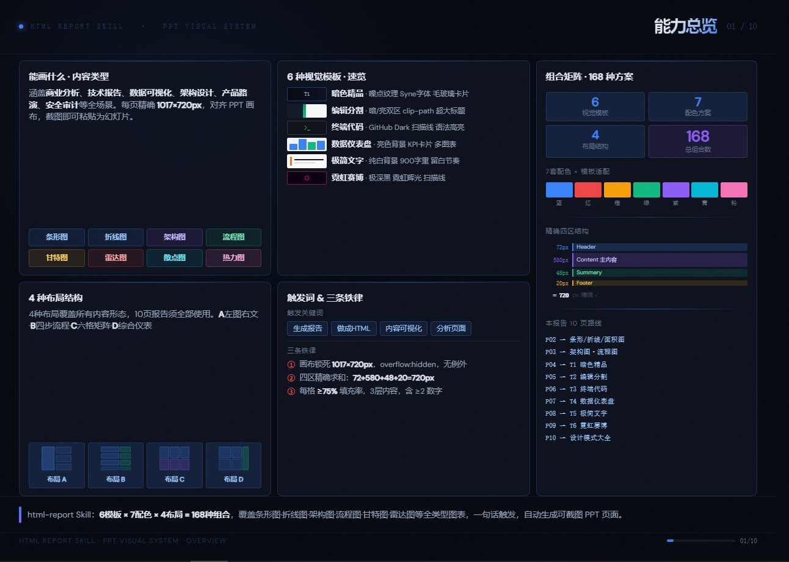
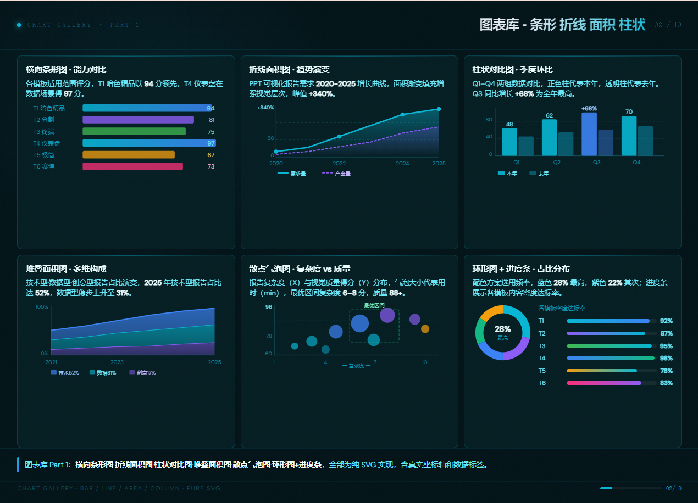
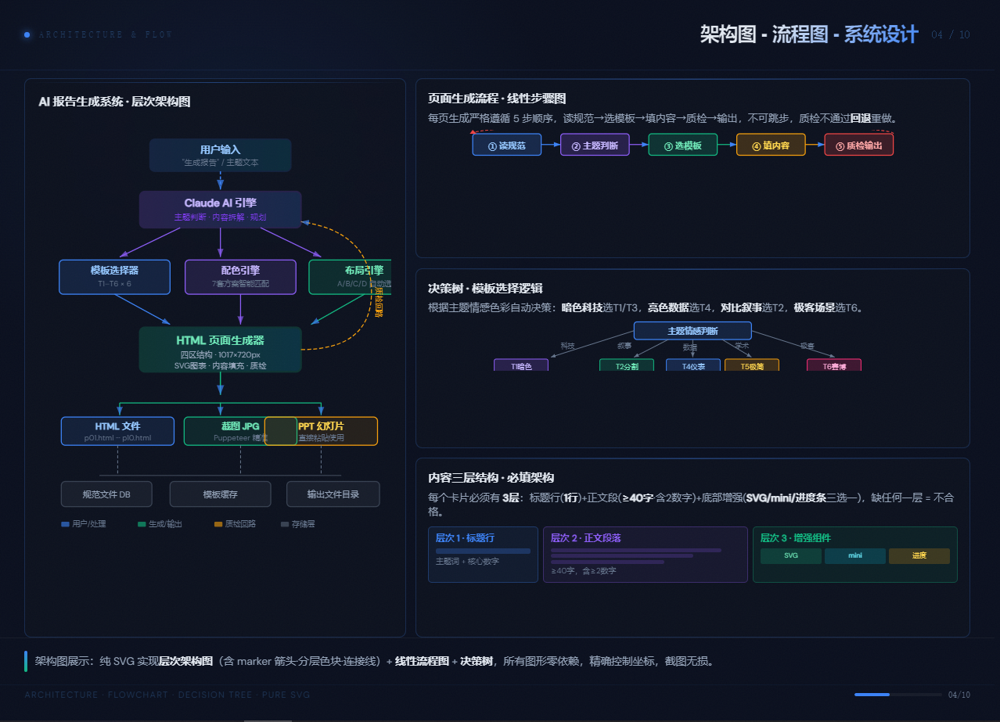
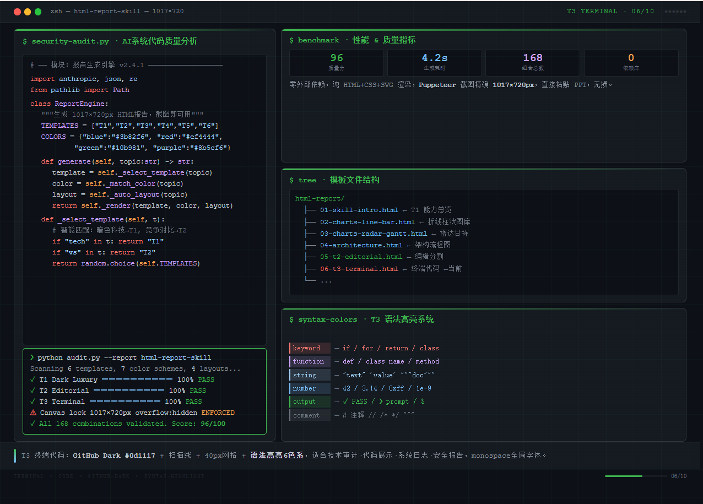

# 🎨 html-report Skill · PPT 视觉报告生成器

> **不知道怎么设计 PPT？一句话触发，自动生成精美的 PPT 风格 HTML 页面。**
> 截图即可粘贴为幻灯片，零手动排版，零设计经验要求。

---

## ✨ 是什么

`html-report` 是一个 Claude Code Skill，将任意文字内容自动转化为**可截图的 PPT 风格 HTML 页面**。

每页严格锁定 **1017×720px**（对齐 PPT 画布 10.59"×7.499" @96dpi），用 Chrome/Puppeteer 截图后可直接粘贴为幻灯片，无需任何 PPT 软件操作。

当你：
- 🤔 **不知道 PPT 该怎么排版** → 说出主题，自动生成
- 📊 **需要图表可视化** → 12+ 种纯 SVG 图表，零依赖
- 🎨 **想要精美设计感** → 6 种视觉模板 × 7 套配色 = 168 种组合
- ⚡ **赶时间** → 4 秒生成一页，10 页报告约 1 分钟完成

---

## 🚀 快速使用

在 Claude Code 中，直接说：

```
生成报告：分析我们公司 2025 年的 AI 战略
```

```
把这份竞争分析做成 HTML 报告页面
```

```
内容可视化：量子计算技术趋势
```

Claude 会自动完成：主题拆解 → 选模板 → 选配色 → 选布局 → 填内容 → 输出 HTML

---

## 🖼️ 样式展示

以下是本 Skill 能生成的各种风格示例，每种模板对应不同的使用场景：

---

### P01 · 能力总览 · T1 暗色精品 · 蓝色

> 适用：封面页、能力介绍、系统总览



**特征：** 噪点纹理背景 · Syne 显示字体 · 毛玻璃卡片 · 蓝色霓虹辉光

---

### P02 · 图表库① · 条形/折线/面积/柱状/散点/环形

> 适用：数据报告、趋势分析、多维度对比



**图表类型：**
- 横向条形图（能力对比）
- 折线面积图（趋势演变）
- 双色柱状对比（季度环比）
- 堆叠面积图（多维构成）
- 散点气泡图（复杂度分布）
- 环形图 + 进度条（占比分布）

---

### P03 · 图表库② · 雷达/甘特/热力矩阵/时间轴/仪表/瀑布

> 适用：项目管理、能力评估、进度追踪


**图表类型：**
- 雷达图（双数据集对比）
- 甘特图（项目进度规划）
- 热力矩阵（7×6 适配度矩阵）
- 横向时间轴（技术演进史）
- 环形仪表 + 多项指标（综合评分）
- 瀑布图（增减分析）

---

### P04 · 架构图 · 流程图 · 决策树（纯 SVG）

> 适用：系统设计、方案展示、流程梳理



**图形类型：**
- 分层架构图（5 层系统结构，marker 箭头）
- 线性流程图（5 步顺序，回退箭头）
- 决策树（5 分支，自动路由）
- 三层内容结构可视化

---

### P05 · T2 编辑分割 · 商业竞争分析 · 红色

> 适用：竞争分析、案例对比、风险评估


**特征：**
- 左暗右亮三层背景（clip-path 斜切分割）
- 左栏 46px 900字重超大标题
- 右栏白/深/彩三类卡片混排
- 6 项 KPI 指标卡 + 横向柱状图

---

### P06 · T3 终端代码 · 代码审计 · 语法高亮

> 适用：技术审计、代码展示、系统日志、安全报告



**特征：**
- GitHub Dark `#0d1117` 背景
- 扫描线纹理 + 40px 网格叠加
- 6 色语法高亮系统（关键词/函数/字符串/数字/输出/注释）
- 终端 prompt 风格 + 文件树结构

---

### P07 · T4 数据仪表盘 · KPI 卡片 · 蓝色

> 适用：数据报告、运营分析、产品月报、业绩展示

**特征：**
- 亮色背景 `#f0f4f8`，高可读性
- KPI 卡片带彩色顶边（3px colored border-top）
- 折线图 + 柱状图 + 散点图 + 环形图混排
- 配色方案场景速查表

---

### P08 · T5 极简文字 · 留白节奏 · 橙色

> 适用：高端品牌报告、年度总结、学术论文、招股书

**特征：**
- 暖白背景 `#fafaf8`
- 900 字重超大标题（52px）
- 单一强调色（橙色 `#f97316` 最佳）
- 1px 细线分割 + 大量留白
- 引言块引用样式

---

### P09 · T6 霓虹赛博 · 威胁情报 · 粉/青/紫

> 适用：安全报告、威胁态势、极客演示、CTF 展示

**特征：**
- 极深黑背景 `#080010`
- 三色霓虹辉光（粉 `#ff2d78` / 青 `#00ffe7` / 紫 `#d2a8ff`）
- 扫描线纹理 + 径向渐变氛围光
- 外发光卡片边框 + 光标闪烁动画
- 威胁雷达图 / CVE 热力矩阵 / Kill Chain 时间轴

---

### P10 · 设计模式大全 · 组件速查

> 适用：最后一页，设计系统说明、组件库展示

**特征：**
- 6 类状态徽章 + 数字角标
- 5 种进度条变体（基础/渐变/分段/条纹/粗细）
- 6 种卡片类型（标准/强调/KPI/深色/渐变/亮色）
- 4 种 Mini 内嵌图表（折线/柱状/热力/环形）
- 6 级排版系统（46px → 8px）

---

## 🧩 组合矩阵

```
6 视觉模板  ×  7 配色方案  ×  4 布局结构  =  168 种组合
```

### 6 种视觉模板

| 代号 | 名称 | 背景 | 适用场景 |
|------|------|------|----------|
| **T1** | 暗色精品 | `#05080f` 深黑 | 科技·AI·高端商业 |
| **T2** | 编辑分割 | 暗左亮右 clip-path | 竞争·对比·强叙事 |
| **T3** | 终端代码 | `#0d1117` GitHub Dark | 技术·代码·安全审计 |
| **T4** | 数据仪表盘 | `#f0f4f8` 亮色 | 数据·运营·月报 |
| **T5** | 极简文字 | `#fafaf8` 暖白 | 品牌·年报·学术 |
| **T6** | 霓虹赛博 | `#080010` 极深 | 安全·极客·创意 |

### 7 套配色方案

| 配色 | 主色 | 最佳搭配模板 | 场景语义 |
|------|------|-------------|----------|
| 🔵 蓝色 | `#3b82f6` | T1 / T4 | 科技·信任·数据 |
| 🔴 红色 | `#ef4444` | T2 | 竞争·风险·紧迫 |
| 🟠 橙色 | `#f59e0b` | T5 | 商业·活力·增长 |
| 🟢 绿色 | `#10b981` | T3 | 健康·成功·环保 |
| 🟣 紫色 | `#8b5cf6` | T1 / T6 | 创意·AI·高端 |
| 🩵 青色 | `#06b6d4` | T1 / T4 | 清爽·效率·数字 |
| 🩷 粉色 | `#f472b6` | T6 | 极客·霓虹·创新 |

### 4 种布局结构

| 布局 | 结构 | 最适合 |
|------|------|--------|
| **A** | 左大图 + 右三行卡片 | 架构图·流程图·单图主导 |
| **B** | 4×2 网格（上下两排） | 步骤流程·四象限·对比 |
| **C** | 3×2 六格矩阵 | 图表库·多维数据·全面展示 |
| **D** | 2×2 + 右侧通栏 | 综合仪表·混排·封面 |

---

## 📐 技术规格

```
画布尺寸：  1017 × 720 px（=PPT 10.59" × 7.499" @96dpi）
四区结构：  Header 72px + Content 580px + Summary 48px + Footer 20px = 720px
内容宽度：  1017 - 25×2 = 967px（可用区域）
图表实现：  纯 SVG，零外部依赖
截图工具：  Chrome / Puppeteer（精确 1:1 还原）
字体：      Syne 800（标题）+ DM Sans（正文）+ monospace（代码）
```

---

## ⚙️ 三条铁律

> 违反任意一条 → 该页推翻重做，无例外。

**① 画布锁死 1017×720px**
```css
html, body {
  width: 1017px; height: 720px;
  min-width: 1017px; max-width: 1017px;
  min-height: 720px; max-height: 720px;
  overflow: hidden;
}
```

**② 四区高度精确求和 720px**
```
Header   72px  ←  页眉
Content 580px  ←  主内容
Summary  48px  ←  摘要栏
Footer   20px  ←  页脚
──────────────
         720px  ✓
```

**③ 每格内容密度 ≥ 75%**
- 3 层内容结构：标题行 + 正文（≥40字含≥2数字）+ 底部增强组件
- 底部增强：SVG 图表 / Mini 数字卡 / 进度条，三选一

---

## 🗂️ Skill 文件结构

```
html-report/
├── SKILL.md              ← Skill 主入口（Claude 读取）
└── references/
    ├── 01-canvas.md      ← 画布尺寸、四区结构、溢出规则
    ├── 02-design-system.md ← 6种视觉模板（T1–T6）CSS片段
    ├── 03-layout.md      ← 4种布局精确 CSS + 空间计算
    ├── 04-color-font.md  ← 7套配色、字体规则、语义色
    ├── 05-content.md     ← 反偷懒规则、内容密度、SVG图表库
    └── 06-workflow.md    ← 规划流程、渲染验证、质量清单
```

---

## 📋 触发关键词

在对话中包含以下任意词汇即可触发：

- `生成报告` / `做成报告`
- `做成HTML` / `生成HTML页面`
- `内容可视化` / `可视化报告`
- `分析页面` / `PPT页面`

---

## 🔄 生成流程

```
用户输入主题
     ↓
AI 读取 Skill 规范（6个参考文件）
     ↓
主题拆解 → 10个子维度规划
     ↓
每页：选模板(T1-T6) → 选配色 → 选布局 → 写内容 → 质检
     ↓
输出 01.html ... 10.html
     ↓
Puppeteer 截图 → 1017×720px PNG
     ↓
粘贴为 PPT 幻灯片 ✓
```

---

## 💡 使用建议

| 场景 | 推荐组合 | 说明 |
|------|----------|------|
| 商业计划书 | T1蓝 + T4蓝 + T5橙 | 专业感强，数据可信 |
| 技术方案 | T1蓝 + T3绿 + T4青 | 科技感，代码展示 |
| 竞品分析 | T2红 + T4蓝 | 对比鲜明，数据驱动 |
| 安全报告 | T6粉 + T3绿 + T1紫 | 威胁感知，技术专业 |
| 年度总结 | T5橙 + T1蓝 + T4蓝 | 高端大气，数据丰富 |
| 产品发布 | T6粉 + T1紫 + T2红 | 视觉冲击，记忆深刻 |

---

## 📄 License

MIT · 可自由用于商业和个人项目
