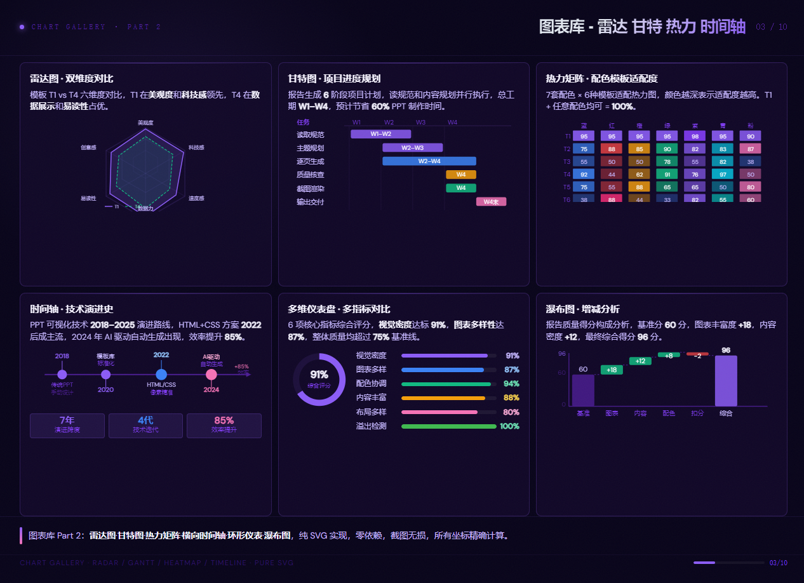
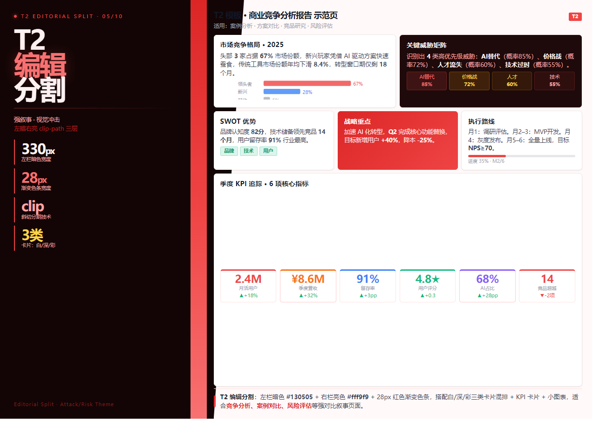
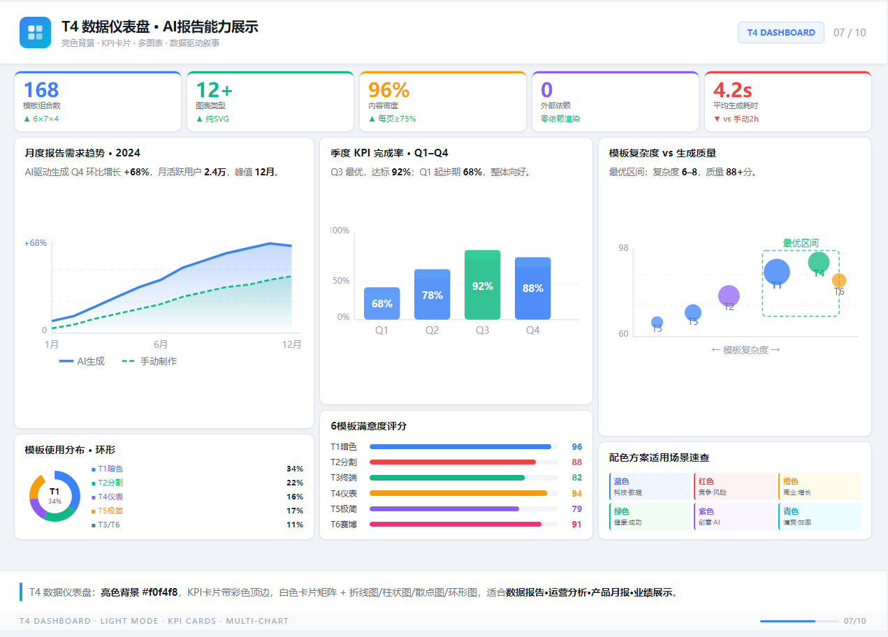
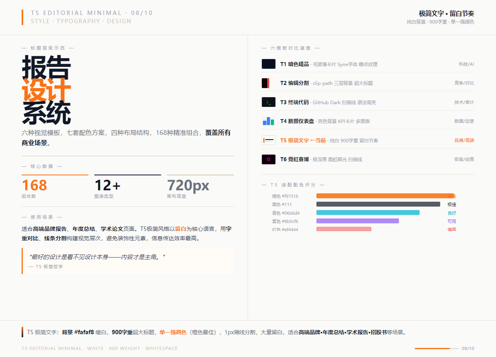
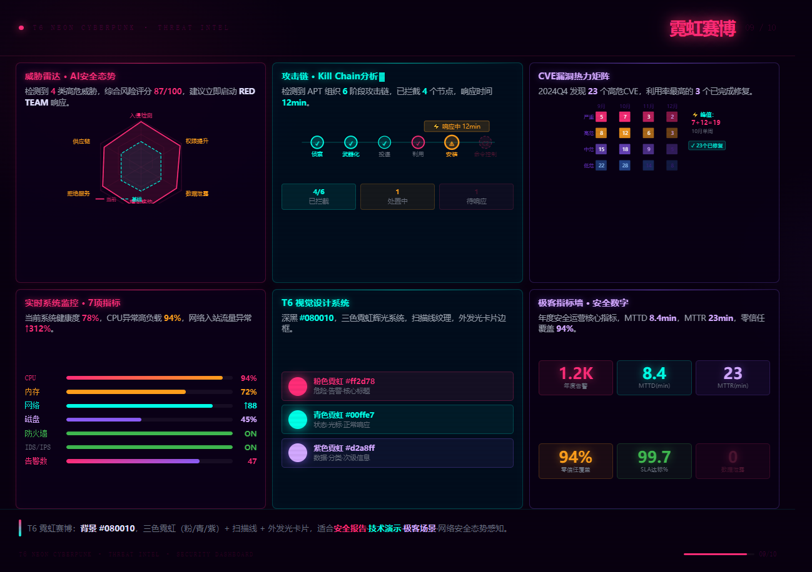
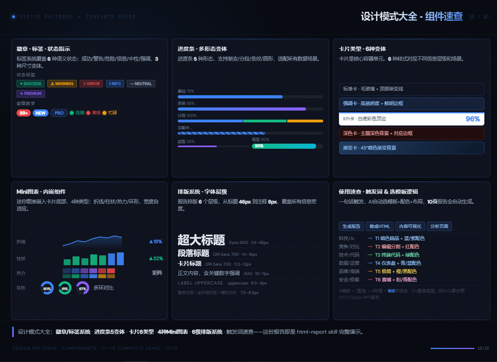

[](README.md) [](README_EN.md)

# 🎨 html-report Skill · PPT Visual Report Generator

> **No idea how to design a PPT? Say one sentence, get a beautiful PPT-style HTML page — automatically.**
> Screenshot it, paste it into any slide deck. Zero manual layout. Zero design experience required.

---

## ✨ What Is It

`html-report` is an AI agent Skill that transforms any text content into **screenshot-ready PPT-style HTML pages**.

Compatible with Claude Code, Doubao (豆包), Cursor, Windsurf, and other major AI coding assistants. Every page is strictly locked to **1017×720px** (aligned to PPT canvas 10.59"×7.499" @96dpi). After screenshotting with Chrome or Puppeteer, the result can be pasted directly as a slide — no PowerPoint software needed.

When you:
- 🤔 **Have no idea how to lay out a PPT** → Describe the topic, get a generated page
- 📊 **Need chart visualization** → 12+ pure SVG chart types, zero dependencies
- 🎨 **Want a polished look** → 6 visual templates × 7 color schemes = 168 combinations
- ⚡ **Are short on time** → ~4 seconds per page, a 10-page report in about 1 minute

---

## 🚀 Quick Start

In any AI agent (Claude Code / Doubao / Cursor etc.), just say:

```
Generate a report: analyze our company's 2025 AI strategy
```

```
Turn this competitive analysis into an HTML report page
```

```
Visualize content: quantum computing technology trends
```

The AI will automatically handle: topic breakdown → template selection → color scheme → layout → content → HTML output

---

## 🐟 HTML → PPT One-to-One Conversion

> **After generating the HTML, send it to Doubao, Claude, or any AI — one prompt converts it to a real PPT!**

Copy the generated HTML content and send it to any AI assistant that supports file or long-text input, with this prompt:

```
Please convert this HTML page into a PowerPoint slide (PPTX format),
reproducing the layout, colors, charts, and content exactly 1:1.
Canvas size is 1017×720px. Keep all visual elements at their exact
position, size, and color.
```

**Recommended AI Tools:**

| Tool | Strengths | Best For |
|------|-----------|----------|
| 🦞 **Doubao** (ByteDance) | File upload, one-click PPTX output | Quick conversion, daily use |
| 🤖 **Claude** (Anthropic) | Understands complex layouts, high fidelity | Precise reproduction, complex charts |
| ✨ **Qwen** (Alibaba) | Optimized for Chinese content, smooth PPT generation | Chinese-language reports |
| 💡 **Kimi** (Moonshot) | Long context window, handles full HTML input | Multi-page batch processing |

**Workflow:**

```
① AI agent generates HTML files
        ↓
② Send the HTML content/file to Doubao or Claude
        ↓
③ Paste the prompt: "Convert to PPT 1:1 based on page layout"
        ↓
④ Download PPTX, ready to present ✓
```

---

## 🖼️ Style Showcase

The examples below demonstrate all the styles this Skill can generate. Each template targets a different use case.

---

### P01 · Overview · T1 Dark Luxury · Blue

> Best for: cover pages, capability introductions, system overviews


**Characteristics:** Noise-texture background · Syne display font · Frosted-glass cards · Blue neon glow

---

### P02 · Chart Library ① · Bar / Line / Area / Column / Scatter / Donut

> Best for: data reports, trend analysis, multi-dimensional comparisons


**Chart types:**
- Horizontal bar chart (capability comparison)
- Line + area chart (trend evolution)
- Dual-color grouped column chart (QoQ comparison)
- Stacked area chart (multi-dimension composition)
- Scatter / bubble chart (complexity distribution)
- Donut chart + progress bars (share breakdown)

---

### P03 · Chart Library ② · Radar / Gantt / Heatmap / Timeline / Gauge / Waterfall

> Best for: project management, capability assessment, progress tracking



**Chart types:**
- Radar chart (dual-dataset comparison)
- Gantt chart (project schedule planning)
- Heatmap matrix (7×6 compatibility matrix)
- Horizontal timeline (technology evolution history)
- Ring gauge + multi-metric indicators (composite score)
- Waterfall chart (increase/decrease analysis)

---

### P04 · Architecture Diagram · Flowchart · Decision Tree (pure SVG)

> Best for: system design, solution presentation, process mapping


**Diagram types:**
- Layered architecture diagram (5-tier system structure with marker arrows)
- Linear flowchart (5-step sequence with back arrows)
- Decision tree (5 branches, auto-routed)
- 3-layer content structure visualization

---

### P05 · T2 Editorial Split · Business Competitive Analysis · Red

> Best for: competitive analysis, case comparison, risk assessment



**Characteristics:**
- Three-layer background: dark left + light right via clip-path diagonal split
- Left column: 46px weight-900 oversized title
- Right column: mixed white / dark / accent card types
- 6 KPI metric cards + horizontal bar chart

---

### P06 · T3 Terminal Code · Code Audit · Syntax Highlighting

> Best for: technical audits, code display, system logs, security reports


**Characteristics:**
- GitHub Dark `#0d1117` background
- Scanline texture + 40px grid overlay
- 6-color syntax highlight system (keywords / functions / strings / numbers / output / comments)
- Terminal prompt style + file tree structure

---

### P07 · T4 Data Dashboard · KPI Cards · Blue

> Best for: data reports, operations analysis, product monthly reports, performance display



**Characteristics:**
- Light background `#f0f4f8`, high readability
- KPI cards with colored top border (3px `border-top`)
- Mixed line chart + column chart + scatter plot + donut chart
- Color scheme quick-reference grid by use case

---

### P08 · T5 Editorial Minimal · Whitespace Rhythm · Orange

> Best for: premium brand reports, annual summaries, academic papers, prospectuses



**Characteristics:**
- Warm white background `#fafaf8`
- 900-weight oversized title (52px)
- Single accent color (orange `#f97316` is optimal)
- 1px thin dividers + generous whitespace
- Pull-quote / blockquote style

---

### P09 · T6 Neon Cyberpunk · Threat Intelligence · Pink / Cyan / Purple

> Best for: security reports, threat posture dashboards, geek demos, CTF presentations



**Characteristics:**
- Deep-black background `#080010`
- Three-color neon glow (pink `#ff2d78` / cyan `#00ffe7` / purple `#d2a8ff`)
- Scanline texture + radial gradient ambient light
- Outer-glow card borders + cursor blink animation
- Threat radar chart / CVE heatmap matrix / Kill Chain timeline

---

### P10 · Design Patterns · Component Quick Reference

> Best for: final pages, design system explanations, component library showcases



**Characteristics:**
- 6 status badge types + numeric badges
- 5 progress bar variants (basic / gradient / segmented / striped / thick)
- 6 card types (standard / accent / KPI / dark / gradient / light)
- 4 mini embedded chart types (line / column / heatmap / donut)
- 6-level typography system (46px → 8px)

---

## 🧩 Combination Matrix

```
6 Templates  ×  7 Color Schemes  ×  4 Layout Structures  =  168 Combinations
```

### 6 Visual Templates

| Code | Name | Background | Best For |
|------|------|------------|----------|
| **T1** | Dark Luxury | `#05080f` deep black | Tech · AI · Premium business |
| **T2** | Editorial Split | Dark left + light right clip-path | Competition · Contrast · Strong narrative |
| **T3** | Terminal Code | `#0d1117` GitHub Dark | Tech · Code · Security audit |
| **T4** | Data Dashboard | `#f0f4f8` light | Data · Operations · Monthly reports |
| **T5** | Editorial Minimal | `#fafaf8` warm white | Brand · Annual reports · Academic |
| **T6** | Neon Cyberpunk | `#080010` ultra-dark | Security · Geek · Creative |

### 7 Color Schemes

| Color | Primary | Best Templates | Semantic |
|-------|---------|---------------|---------|
| 🔵 Blue | `#3b82f6` | T1 / T4 | Tech · Trust · Data |
| 🔴 Red | `#ef4444` | T2 | Competition · Risk · Urgency |
| 🟠 Orange | `#f59e0b` | T5 | Business · Energy · Growth |
| 🟢 Green | `#10b981` | T3 | Health · Success · Sustainability |
| 🟣 Purple | `#8b5cf6` | T1 / T6 | Creative · AI · Premium |
| 🩵 Cyan | `#06b6d4` | T1 / T4 | Fresh · Efficiency · Digital |
| 🩷 Pink | `#f472b6` | T6 | Geek · Neon · Innovation |

### 4 Layout Structures

| Layout | Structure | Best For |
|--------|-----------|----------|
| **A** | Large left + right 3-row cards | Architecture · Flowcharts · Single-chart focus |
| **B** | 4×2 grid (two rows) | Step-by-step · Four quadrants · Comparison |
| **C** | 3×2 six-cell matrix | Chart library · Multi-dimensional data · Full coverage |
| **D** | 2×2 + right full-height | Mixed dashboard · Hybrid layout · Cover |

---

## 📐 Technical Specs

```
Canvas size:    1017 × 720 px  (= PPT 10.59" × 7.499" @96dpi)
4-zone layout:  Header 72px + Content 580px + Summary 48px + Footer 20px = 720px
Content width:  1017 - 25×2 = 967px (usable area)
Charts:         Pure SVG, zero external dependencies
Screenshot:     Chrome / Puppeteer (pixel-perfect 1:1)
Fonts:          Syne 800 (headings) + DM Sans (body) + monospace (code)
```

---

## ⚙️ Three Iron Rules

> Violating any one of these → the page is scrapped and rebuilt. No exceptions.

**① Canvas locked to 1017×720px**
```css
html, body {
  width: 1017px; height: 720px;
  min-width: 1017px; max-width: 1017px;
  min-height: 720px; max-height: 720px;
  overflow: hidden;
}
```

**② Four-zone heights must sum exactly to 720px**
```
Header   72px  ←  page header
Content 580px  ←  main content
Summary  48px  ←  summary bar
Footer   20px  ←  page footer
──────────────
Total   720px  ✓
```

**③ Content density ≥ 75% per cell**
- 3-layer content structure: title row + body text (≥ 40 chars, ≥ 2 numbers) + bottom enhancement component
- Bottom enhancement: SVG chart / mini number cards / progress bars — pick one

---

## 🗂️ Skill File Structure

```
html-report/
├── SKILL.md              ← Skill entry point (read by AI agent)
├── demo/                 ← Example pages & screenshot previews
│   ├── 01-skill-intro.html / .PNG     ← T1 Dark Luxury · Overview
│   ├── 02-charts-line-bar.html / .PNG ← Chart Library ① (bar/line/column/scatter/donut)
│   ├── 03-charts-radar-gantt.html / .PNG ← Chart Library ② (radar/gantt/heatmap/waterfall)
│   ├── 04-architecture.html / .PNG    ← Architecture · Flowchart · Decision Tree
│   ├── 05-t2-editorial.html / .PNG    ← T2 Editorial Split · Competitive Analysis
│   ├── 06-t3-terminal.html / .PNG     ← T3 Terminal Code · Syntax Highlight
│   ├── 07-t4-dashboard.html / .PNG    ← T4 Data Dashboard · KPI Cards
│   ├── 08-t5-minimal.html / .PNG      ← T5 Editorial Minimal · Whitespace
│   ├── 09-t6-cyberpunk.html / .PNG    ← T6 Neon Cyberpunk · Threat Intel
│   └── 10-design-patterns.html / .PNG ← Design Patterns · Component Reference
└── references/
    ├── 01-canvas.md        ← Canvas size, 4-zone structure, overflow rules
    ├── 02-design-system.md ← 6 visual templates (T1–T6) CSS snippets
    ├── 03-layout.md        ← 4 layout CSS + space calculations
    ├── 04-color-font.md    ← 7 color schemes, font rules, semantic colors
    ├── 05-content.md       ← Anti-laziness rules, content density, SVG chart library
    └── 06-workflow.md      ← Planning workflow, render verification, quality checklist
```

---

## 📋 Trigger Keywords

Include any of the following in your conversation to activate the skill:

- `generate report` / `make a report`
- `make HTML` / `generate HTML page`
- `visualize content` / `visual report`
- `analysis page` / `PPT page`

---

## 🔄 Generation Flow

```
User inputs topic
      ↓
AI reads Skill spec (6 reference files)
      ↓
Topic breakdown → plan 10 sub-dimensions
      ↓
Per page: select template (T1–T6) → color scheme → layout → write content → QA
      ↓
Output 01.html ... 10.html
      ↓
Option ①: Chrome/Puppeteer screenshot → 1017×720px PNG → paste into PPT slides
Option ②: Send HTML to Doubao/Claude → "Convert to PPT 1:1" → download PPTX ✓
```

---

## 💡 Usage Suggestions

| Scenario | Recommended Combo | Notes |
|----------|-------------------|-------|
| Business plan | T1 Blue + T4 Blue + T5 Orange | Professional, data-credible |
| Technical proposal | T1 Blue + T3 Green + T4 Cyan | Tech feel, code showcase |
| Competitive analysis | T2 Red + T4 Blue | High contrast, data-driven |
| Security report | T6 Pink + T3 Green + T1 Purple | Threat awareness, technical authority |
| Annual summary | T5 Orange + T1 Blue + T4 Blue | Premium, data-rich |
| Product launch | T6 Pink + T1 Purple + T2 Red | Visual impact, memorable |

---

## 📄 License

MIT · Free for commercial and personal use
